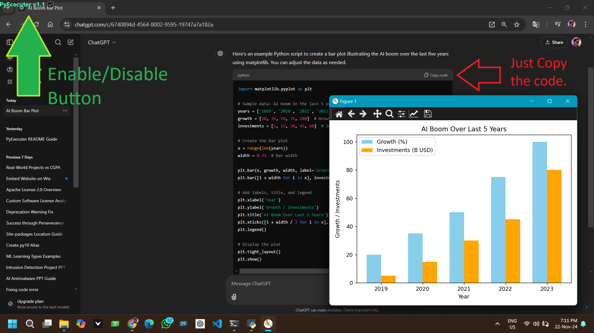

# Abhiiverma0007
Clipboard Python Runner

Overview:-

	The Clipboard Python Runner is a simple utility program designed to execute Python code snippets directly from your
	clipboard or websites. It aims to facilitate rapid code testing and debugging by allowing you to quickly run Python
	code without the need to save it to a file and execute it manually.

Features:-

	Automatically detects Python code copied to the clipboard.
	Executes the Python code snippet with the default Python interpreter.
	Provides instant feedback on the output.
	Toggleable via a user-friendly checkbox named PyExecuter.
	
How to use:-
	
	1. install the python 3.11 or above
	2. install required libraries using following command

	   pip install pyperclip
	   pip install pyside6==6.7.1
	   pip install pywin32

	3. run the pytester.py prorgam
	4. copy the python code or snippet
	5. the output of the copied snippet will run in external console within point of time

How to Run:-

	1.Clone or download the repository.
	2.Run the script with Python:

	3.python pytester.py
	4.Enable the PyExecuter checkbox in the program interface.
	5.Copy any Python code from anywhere in Windows. The program will automatically detect and execute it.

Example:-

    Suppose you have the following Python code snippet copied to your clipboard:

python
    Copy code

    print("Hello, World!")
    copied the Clipboard of the above snippet in the clipboard will produce the following output directly in a new terminal:

Copied code output
    Hello, World!

Important Notes:-

	Use this tool cautiously. Always validate the copied code before execution to avoid unintended consequences.
	Ensure administrative privileges if required for clipboard or system-related operations.
	For any errors during installation or runtime, verify Python version and module compatibility.

If you have any suggestions, improvements, or feature requests, feel free to suggest in abhishek639679@gmail.com
